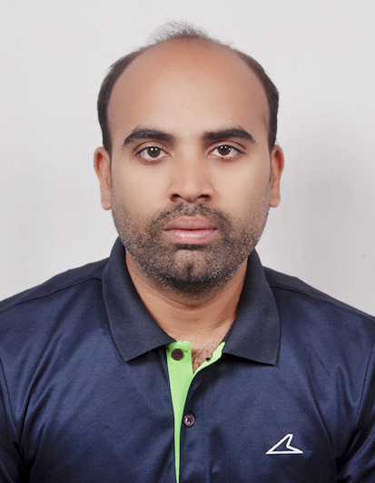

# 🚀 Master 5G by Building It

Learn 5G by deploying real networks. This hands-on workshop takes you from basics to running a complete 5G system using OpenAirInterface, the leading open-source 5G platform.

**All you need:** A laptop, internet, and curiosity!

---

## 📅 Workshop Overview

**Duration:** 2 full days (6 hours/day)  
**Format:** 60% Hands-on, 40% Interactive Sessions

**Day 1:** Introdction to 5G/6G and O-RAN & Getting Started with OAI  
**Day 2:** Protocol Stack Deep-Dive & RAN experiments with OAI

**What You'll Achieve:**
- �️ Deploy your own 5G network from scratch
- 🔬 Analyze 5G protocols with professional tools
- 🎯 Gain practical skills for research and development

[View Detailed Schedule →](docs/workshop/)

---

## 👥 Who Should Attend?

This workshop is designed for students, faculty, and telecom engineers who want hands-on 5G experience:

- **Undergraduate students** in ECE/CSE (completed digital communications & networking courses)
- **Graduate students** specializing in communications, signal processing, or cyber-physical systems
- **Faculty members** seeking practical 5G implementation experience
- **Telecom engineers** building hands-on skills in 5G systems

---
## ⚠️ Prerequisites

  <ul style="margin: 15px 0; padding-left: 20px;">
    <li style="margin: 10px 0;">Basic digital communications and computer networking knowledge</li>
    <li style="margin: 10px 0;">Familiarity with Linux</li>
    <li style="margin: 10px 0;"><strong>Must complete</strong> our <a href="docs/pre-workshop/" style="color: white; text-decoration: underline;">6 self-paced preparation modules</a> (2.5-3 hours total) covering Linux, Git, Docker, C compilation, and networking fundamentals.</li>
  </ul>
  
⚡ Without completing these modules, you won't be able to follow the hands-on exercises

---

## 👨‍🏫 Instructors

    
    <h3 style="margin: 10px 0; font-size: 1.1em;">Rajeev Gangula</h3>
    
Northeastern University

    
Boston, USA

    

        <a href="https://rajeevga.github.io/" target="_blank" style="margin: 0 5px;">🌐 Website</a>
        <a href="mailto:r.gangula@northeastern.edu" style="margin: 0 5px;">✉️ Email</a>
    

    
    <h3 style="margin: 10px 0; font-size: 1.1em;">Rakesh Mundlamuri</h3>
    
OpenAirInterface Software Alliance

    
France

    

        <a href="https://www.linkedin.com/in/rakesh-mundlamuri-25089ba6/" target="_blank" style="margin: 0 5px;">🔗 LinkedIn</a>
    

    
    <h3 style="margin: 10px 0; font-size: 1.1em;">Venkatareddy Akumalla</h3>
    
IOS-MCN, Indian Institute of Science

    
Bengaluru, India

    

        <a href="https://in.linkedin.com/in/venkatareddy-akumalla-86000859" target="_blank" style="margin: 0 5px;">🔗 LinkedIn</a>
    

    
    <h3 style="margin: 10px 0; font-size: 1.1em;"></h3>
    
IOS-MCN, Indian Institute of Science

    
Bengaluru, India

    

        <a href="https://in.linkedin.com/in/" target="_blank" style="margin: 0 5px;">🔗 LinkedIn</a>
    

    
    <h3 style="margin: 10px 0; font-size: 1.1em;"></h3>
    
IOS-MCN, Indian Institute of Science

    
Bengaluru, India

    

        <a href="https://in.linkedin.com/in/" target="_blank" style="margin: 0 5px;">🔗 LinkedIn</a>
    

    
    <h3 style="margin: 10px 0; font-size: 1.1em;"></h3>
    
IOS-MCN, Indian Institute of Science

    
Bengaluru, India

    

        <a href="https://in.linkedin.com/in/" target="_blank" style="margin: 0 5px;">🔗 LinkedIn</a>
    

---

## 🚀 Get Started

[Begin Preparation →](docs/pre-workshop/){: .btn .btn-primary}  
[View Full Schedule →](docs/workshop/){: .btn}

---
